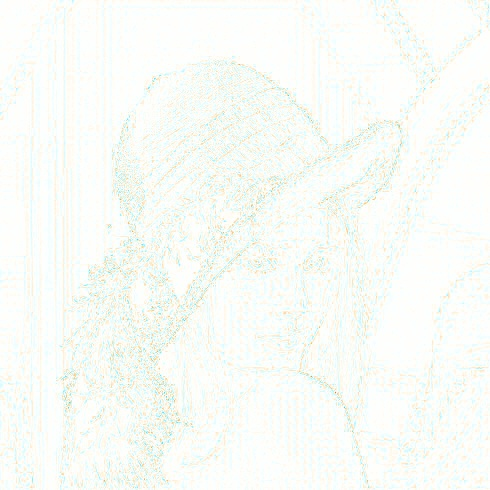
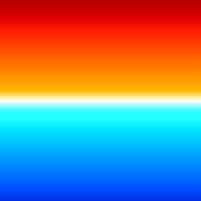
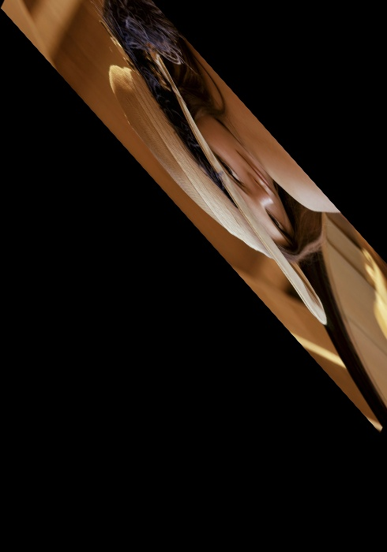
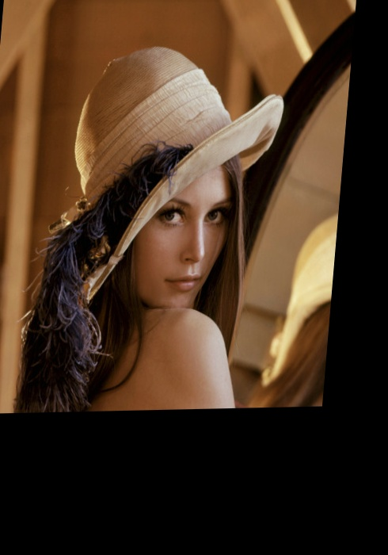

# itools: A set of image-processing tools

itools is a repo containing a set of tools for image processing.

# 1. itools-bayer-conversion.py

This tool converts between different Bayer formats.


# 2. itools-filter.py

This tool provides some image filters, including:
* `gray`: convert image to grayscale.
* `xchroma`: swap chromas (Cb and Cr) in the image.
* `noise`: add noise to the image.
* `diff`: get the diff of 2x images.
* `compose`: compose 2x images.
* `match`: match 2x images (template matching).
* `affine`: performs an affine transform in the input image.


Figure 1 shows an example of an image.


## 2.1. `gray` filter

This filter converts an image to grayscale.

Example
```
$ ./python/itools-filter.py --filter gray -i docs/lena.jpeg -o docs/lena.gray.jpeg
```


Figure 2 shows the original image after being passed through the `gray` filter.


## 2.2. `xchroma` filter

This filter swaps the chromas (Cb and Cr) in the input image.

Example
```
$ ./python/itools-filter.py --filter xchroma -i docs/lena.jpeg -o docs/lena.xchroma.jpeg
```


Figure 3 shows the original image after being passed through the `xchroma` filter.


## 2.3. `noise` filter

This filter adds noise to the input image. The parameter "`--noise-level`" can
be used to add more or less noise.

Example
```
$ ./python/itools-filter.py --filter noise -i docs/lena.jpeg -o docs/lena.noise.jpeg
```


Figure 4 shows the original image after being passed through the `noise` filter.


## 2.4. `diff` filter

This filter gets the difference between 2x frames.

The diff algo works as follows: We convert both frames to grayscale (luma-only), and then diff the actual value of each pixel. We calculate the absolute value of the per-pixel difference (`abs[i,j]`), and then set each pixel in the output file (the "diff image" or "diff frame") as 255 minus the absolute value.

The full algo is:

```
# start with in1[i, j] and in2[i, j]
abs[i,j] = abs(in1[i, j], in2[i, j])
out[i,j] = 255 - abs[i,j]
```

Note that the parts where both input file are different is shown in black, while the parts where they are the same are shown in white.


Example
```
$ ./python/itools-filter.py --filter diff -i docs/lena.jpeg -j docs/lena.noise.jpeg -o docs/lena.diff.jpeg
```


Figure 5 shows the diff between the original image and the output of the `noise` filter.


The diff filter has a "color" mode, where instead of just using a grayscale to report the absolute value of the error, it encodes the actual sign of the luma difference in the chromas.

An example is as follows:
```
$ ffmpeg -i docs/lena.jpeg -q:v 25 docs/lena.encoded.q25.jpeg
$ ./python/itools-filter.py --filter diff -i docs/lena.jpeg -j docs/lena.encoded.q25.jpeg --diff-component y --diff-color --diff-color-factor 3 -o docs.lena.encoded.q25.diff.jpeg
```


Figure 6 shows low-quality, encoded version of the original image (using a quality scale factor of 25).



Figure 7 shows the color diff between the original image and its low-quality encoded version.


The algo to add color works by replacing a grayscale chroma (U=128, V=128) with a set of values (U, V) as follows:
* when the component difference gets close to the maximum (+255), i.e., when the luma of the first image is much larger than that of the second image, the U component (Cb, blue chrome) gets close to 255, and the V component (Cr, red chroma) gets close to 0). In this case, the error shows in blue tones.
* when the component difference gets close to 0, the U (Cb, blue chrome) and V (Cr, red chroma) components are set to 128.
* when the component difference gets close to the minimum (-255), i.e., when the luma of the first image is much smaller than that of the second image, the U component (Cb, blue chrome) gets close to 0, and the V component (Cr, red chroma) gets close to 255). In this case, the error shows in yellow and red tones.


Figure 8 shows an image with a down grayscale range, from lowest luma (black) to highest luma (white).


Figure 9 shows an image with an up grayscale range, from highest luma (white) to lowest luma (black).




Figure 10 shows an image with a color diff of the down and up grayscale. Note that the diff at the top of the 2 grayscales is a negative number (the first image is black, meaning low luma values, while the second image is white, meaning high luma values). This means the error is shown in red and yellow tones. In a similar way, the diff at the top of the 2 grayscales is a positive number (the first image is white and the second image is black). This means the error is show in blue tones.


## 2.5. `compose` filter

This filter composes 2x images, a background image and a needle image. It uses the needle image's alpha channel if it has one. The parameters "`-x`" and "`-y`" can be used to decide the exact location ((0,0) being the top-left point in the destination image).

Example
```
$ ./python/itools-filter.py --filter compose -i docs/lena.jpeg -j docs/needle.png -x 10 -y 30 -o docs/lena.compose.jpeg
```


Figure 11 shows the original image after being composed with the needle image.


## 2.6. `match` filter

This filter performs template matching in 2x images, a haystack image and a needle image. It will produce a copy of the haystack image with a rectangle marking the actual location where it finds the needle in the haystack.

Note that, if the needle has alpha channel, we use randomness to deal with needles with alpha channel (see [here](https://stackoverflow.com/questions/4761940/) for a discussion). This means that, in that case, the results of successive runs may be slightly different.


Example
```
$ ./python/itools-filter.py --filter match -d -i docs/lena.compose.jpeg -j docs/needle.png -o docs/lena.match.jpeg
x0 = 10 y0 = 30
```


Figure 12 shows the original image after being composed with the needle image.


## 2.7. `affine` filter

This filter performs an affine transformation on the input image. The affine transformation is defined using 2x matrices, $A$ and $B$.

```
A = [[a00, a01], [a10, a11]]
B = [[b00], [b10]]
Output = A * input + B
```

Function also allows defining the output size (using parameters "`width`" and "`height`").

Example
```
$ ./python/itools-filter.py --filter affine --height 700 --a00 0.98 --a01 0.14 --a10 1.1 --a11 -0.3 --b00 1 --b10 10 -d -i docs/lena.jpeg -o docs/lena.affine.jpeg
```



Figure 13 shows the output of the affine transformation using the matrices $A=[[0.98, 0.14], [1.1, -0.3])$ and $B=[1, 10]$.


## 2.8. `affine-points` filter

This filter performs an affine transformation on the input image. The affine transformation is defined using 2x set of points, $s$ and $d$. Transformation matrix is calculated such that

```
(s0x, s0y) -> (d0x, d0y)
(s1x, s1y) -> (d1x, d1y)
(s2x, s2y) -> (d2x, d2y)
```

Function also allows defining the output size (using parameters "`width`" and "`height`").

Example
```
$ ./python/itools-filter.py --filter affine-points --height 700 --d0x 5 --d0y -2 --d1x -4 --d1y 105 --d2x 96 --d2y -4 -d -i docs/lena.jpeg -o docs/lena.affine-points.jpeg
...
transform_matrix = array([[ 0.91, -0.09,  5.  ],
       [-0.02,  1.07, -2.  ]])
...
```



Figure 14 shows the output of the affine transformation using the points in the above command.


## 2.9. `rotate` filter

This filter rotates an image (0, 90, 180, or 270 degrees).

Example
```
$ ./python/itools-filter.py --filter rotate -i docs/lena.jpeg --rotate-angle -90 -o docs/lena.rotate.png
```


Figure 15 shows the original image after being passed through the `rotate` filter.


## 2.10. `histogram` filter

This filter produces a histogram of the lumas or chromas of a file. Use the option "`--hist-component [y|u|v|r|g|b]`" to select the actual component.

Example
```
$ ./python/itools-filter.py --filter histogram -i docs/grayscale.down.png -o /tmp/foo.csv
$  csvlook /tmp/foo.csv
| value | hist |  norm |
| ----- | ---- | ----- |
|     0 |  256 | 0.004 |
|     1 |  256 | 0.004 |
|     2 |  256 | 0.004 |
|     3 |  256 | 0.004 |
|     4 |  256 | 0.004 |
|     5 |  256 | 0.004 |
|     6 |  256 | 0.004 |
...
|   252 |  256 | 0.004 |
|   253 |  256 | 0.004 |
|   254 |  256 | 0.004 |
|   255 |  256 | 0.004 |
```


# 3. Requirements

* opencv2
* numpy
